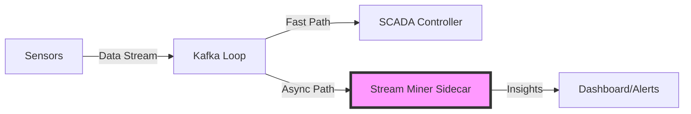

# NT-SCADA: Stream Mining & Advanced Analytics

### **Contributor:** Narayan Anshu
### **Role:** Stream Mining Lead

---

## The Challenge
### Why Traditional SCADA wasn't enough

- **Static Thresholds**: Old systems rely on fixed rules (e.g., `if temp > 50 then ALARM`).
- **Concept Drift**: Physical sensors degrade, seasons change, and "normal" shifts over time.
- **Result**:
    - High False Alarm Rate
    - Missed innovative attacks
    - Inability to adapt without manual retuning

---

## The Solution
### "Sidecar Architecture" for Stream Mining

We moved beyond static monitoring by implementing an **Advanced Analytics Sidecar**.

- **Decoupled**: Runs parallel to the main control loop.
- **Zero Latency Impact**: Complex ML does NOT slow down critical SCADA operations.
- **Scalable**: Can use heavy libraries (like `River`) independently.



---

## Technology Stack

We integrated modern Open Source technologies to modernize the stack:

1.  **River (Online ML)**
    - *Why?* Allows the model to learn from *every single data point* in real-time.
    - *Vs Scikit-learn*: No batch training required. Models evolve instantly.

2.  **Apache Kafka**
    - *Why?* Consumer Groups allow us to "tap" into the data stream without disrupting the main system.

3.  **Python**
    - *Why?* Rich ecosystem for analytics.

---

## Key Algorithm 1: Concept Drift Detection
### **ADWIN (ADaptive WINdowing)**

**Problem**: Is the sensor failing, or is the process just changing?

**Implementation**:
- **ADWIN** automatically adjusts its memory window.
- When the statistical mean of the data changes significantly, it flags **DRIFT**.
- **Benefit**: Automatic self-calibration. reduced manual maintenance.

### Code Implementation (ADWIN)
File: `nt-scada/stream/stream_miner.py`

```python
# Technique 1: Concept Drift Detection
# We feed the value into ADWIN. If it detects a significant change in mean,
# it flags a drift.
adwin = self.get_drift_detector(sensor_id)
adwin.update(value)

if adwin.drift_detected:
    mining_results['drift_detected'] = True
    mining_results['drift_info'] = f"Distribution changed. New mean approx: {adwin.estimation:.2f}"
    print(f" DRIFT DETECTED for {sensor_id}: {mining_results['drift_info']}")
```

---

## Key Algorithm 2: Online Learning
### **Hoeffding Trees**

**Problem**: Static ML models are obsolete the moment they are deployed.

**Implementation**:
- **Incremental Decision Tree**: Updates its structure with *each incoming sample*.
- **Adaptive**: Can learn new "Normal" states on the fly.
- **Efficient**: Uses constant memory, regardless of data volume.

### Code Implementation (Online Learning)
File: `nt-scada/stream/stream_miner.py`

```python
# Technique 3: Online Learning (Supervised)
# Create a feature vector
features = {'value': value, 'sensor_id': sensor_id}

# Predict first (Test-then-Train)
prediction = self.model.predict_one(features)
mining_results['model_prediction'] = prediction

# Generate a synthetic label for training (Simulating ground truth)
actual_label = 'CRITICAL' if value > 90 or value < 10 else 'NORMAL'

# Train the model incrementally
self.model.learn_one(features, actual_label)
```

```

---

## Verified System Outputs

### 1. Console Logs (Drift Detection)
What you see when running the code:
```text
============================================================
NT-SCADA Stream Miner (Advanced Analytics Sidecar)
Techniques:   ADWIN Drift Detection, Hoeffding Tree
============================================================
✓ Stream Miner connected to Kafka at localhost:9092
...
⚠ DRIFT DETECTED for SENSOR_FIT_101: Distribution changed. New mean approx: 52.45
⚠ DRIFT DETECTED for SENSOR_LIT_301: Distribution changed. New mean approx: 810.20
```

### 2. Zero-Latency JSON Output
Data produced to `scada.mining.results` topic:
```json
{
  "sensor_id": "SENSOR_FIT_101",
  "timestamp": "2023-12-18T10:05:23.00Z",
  "drift_detected": true,
  "model_prediction": "CRITICAL",
  "rolling_variance": 12.5
}
```

---

## Impact & Results

| Feature | Before (Legacy) | **After (Stream Mining)** |
| :--- | :--- | :--- |
| **Adaptability** | Manual updates required | **Self-learning & Adaptive** |
| **Latency** | Low | **Zero Impact** (Sidecar) |
| **Coverage** | Simple Thresholds | **Complex Statistical Analysis** |
| **Maintenance** | High (Retuning rules) | **Low** (Automated drift detection) |

---

# Conclusion

The **Stream Mining Module** transforms NT-SCADA from a passive monitoring tool into an **intelligent, adaptive system**.

### Questions?
